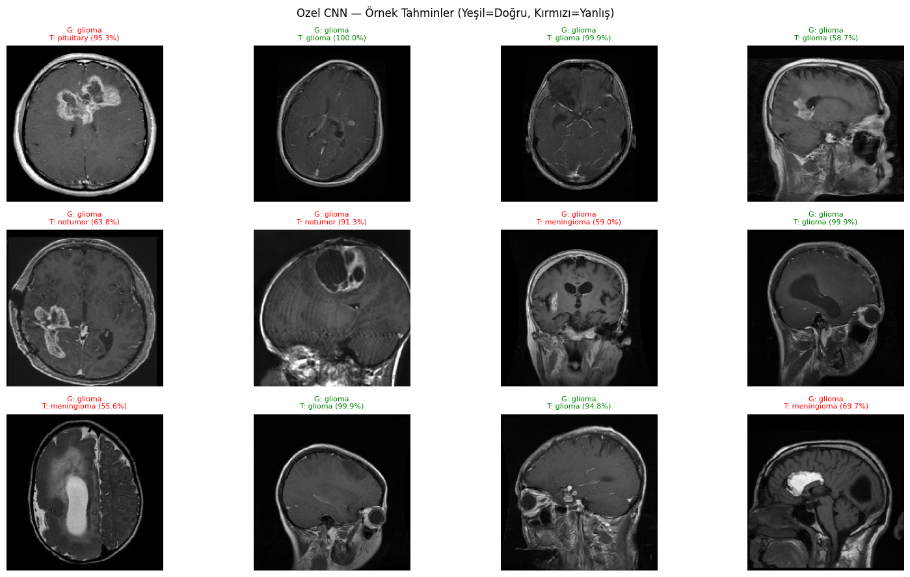
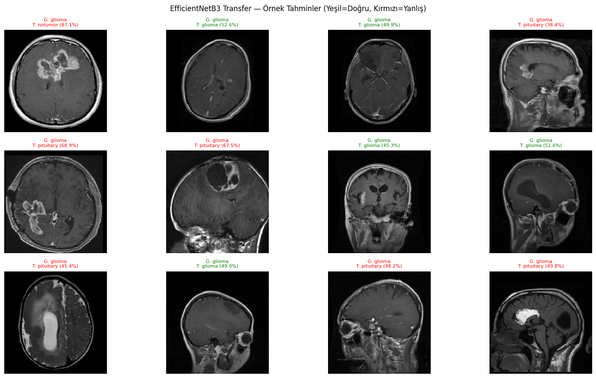
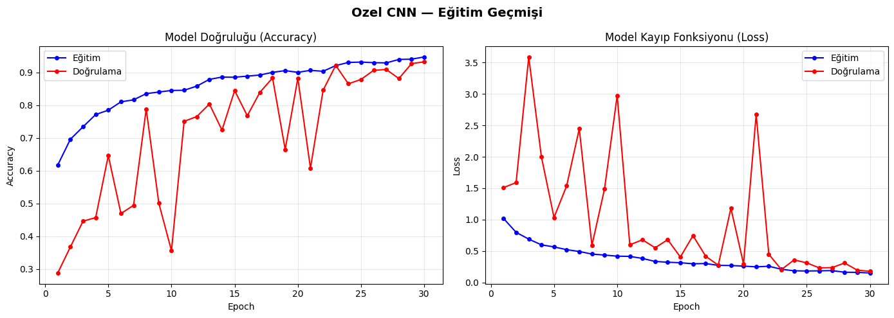
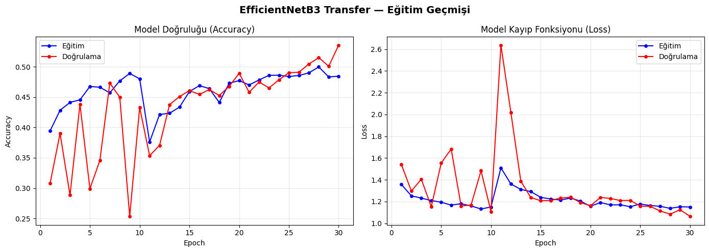
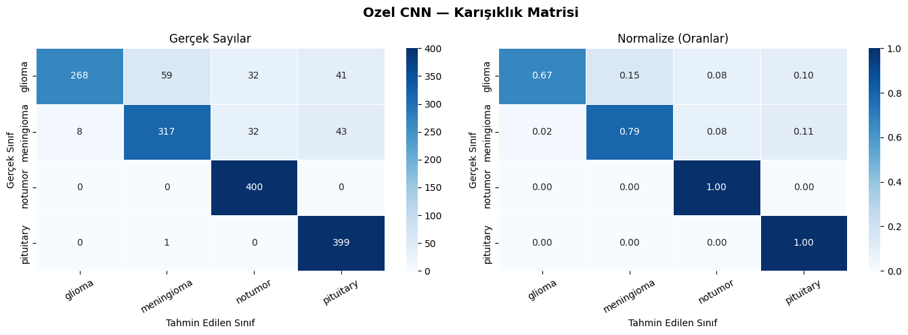
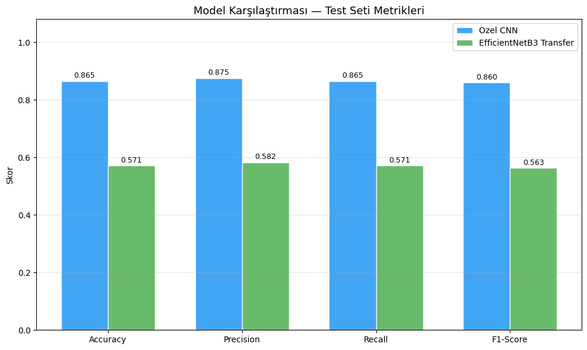
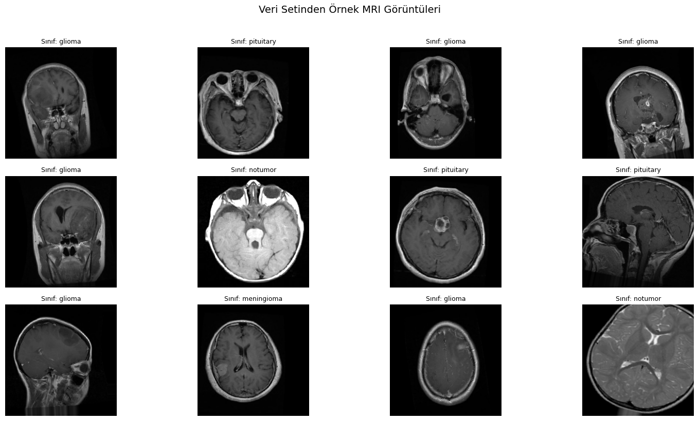

# 🧠 MRI Brain Tumor Classification with Deep Learning

## 📌 Overview
This project focuses on the automatic classification of brain tumors from MRI images using deep learning techniques. The study presents a comparative analysis between a custom Convolutional Neural Network (CNN) and a transfer learning approach based on EfficientNetB3.

The goal is not only to achieve high accuracy but also to analyze model behavior under real-world constraints and highlight the limitations of transfer learning in medical imaging.

---

## 🚀 Key Features
- 🧠 Brain tumor classification from MRI scans (4 classes)
- 🔬 Comparative study: Custom CNN vs EfficientNetB3
- 📊 Detailed performance evaluation (Accuracy, Precision, Recall, F1-score)
- 🔁 Data augmentation for improved generalization
- ⚙️ Training optimization (EarlyStopping, ReduceLROnPlateau)
- 📉 Training history visualization (loss & accuracy curves)
- 🧪 Transparent analysis of model failures

---

## 🗂️ Dataset
- **Source:** Kaggle Brain Tumor MRI Dataset  
- **Classes:**
  - Glioma
  - Meningioma
  - Pituitary
  - No Tumor  
- ~7,000+ MRI images  
- Balanced dataset with train/validation/test split  

---

## 🧠 Models

### 🔹 Model A — Custom CNN
- Built from scratch
- 3 convolutional blocks
- Batch Normalization + Dropout
- Lightweight (~323K parameters)

✅ **Test Accuracy:** 86.5%  
✅ **F1 Score:** 0.86  

---

### 🔹 Model B — EfficientNetB3 (Transfer Learning)
- Pretrained on ImageNet
- Two-stage training:
  - Frozen base training
  - Fine-tuning last layers

⚠️ **Test Accuracy:** 57.1%  

---

## 📊 Results Summary

| Metric        | Custom CNN | EfficientNetB3 |
|--------------|-----------|----------------|
| Accuracy     | 86.5%     | 57.1%          |
| Precision    | 0.875     | 0.582          |
| Recall       | 0.865     | 0.571          |
| F1 Score     | 0.860     | 0.563          |

---

## 🔍 Key Insights

### ❗ Transfer Learning is Not Always Better
EfficientNetB3 significantly underperformed compared to the custom CNN.

### 📌 Domain Mismatch Problem
Models pretrained on ImageNet (natural images) may fail on medical imaging data such as MRI due to:
- Different texture patterns
- Grayscale vs RGB differences
- Structural symmetry in medical images

### 📉 Class-Level Observation
- High precision but low recall for **Glioma**
- Perfect recall for **No Tumor** and **Pituitary**

➡️ Indicates the importance of class-wise evaluation in medical AI.

---

## 🛠️ Tech Stack
- Python
- TensorFlow / Keras
- NumPy, Pandas
- Matplotlib / Seaborn
- Google Colab (GPU: T4)

---

## ⚙️ Training Details
- Image size: 224x224
- Batch size: 32
- Optimizer: Adam
- Loss: Categorical Crossentropy

**Callbacks:**
- EarlyStopping (patience=7)
- ReduceLROnPlateau (factor=0.5)

---

## 📈 Future Work
- 🔬 Use medical pretrained models (e.g., RadImageNet)
- 📊 Improve Glioma recall with class weighting
- 🧠 Try ResNet50 / VGG16 architectures
- 🧩 Extend to 3D MRI data
- 🔍 Fix and integrate Grad-CAM visualization

---

## 📸 Sample Outputs

### 🧠 CNN Predictions
<p align="center">
  
</p>

### 🧠 EfficientNet Predictions
<p align="center">
  
</p>

---

### 📊 Training Performance (CNN)
<p align="center">
  
</p>

### 📊 Training Performance (EfficientNetB3)
<p align="center">
  
</p>

---

### 📉 Confusion Matrix (CNN)
<p align="center">
  
</p>

### 📉 Confusion Matrix (EfficientNetB3)
<p align="center">
  
</p>

---

### ⚖️ Model Comparison
<p align="center">
  
</p>

---

### 🧾 Sample MRI Images
<p align="center">
  
</p>

---

## 📦 Installation

```bash
git clone https://github.com/omidhabib/brain-tumor-classification.git
cd brain-tumor-classification
pip install -r requirements.txt
